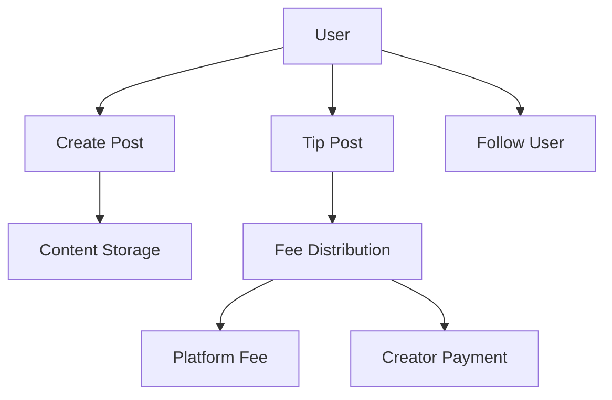

# Decentralized Social Platform Smart Contract

A robust, feature-rich social media platform built on the Stacks blockchain using Clarity smart contracts. This platform enables content creation, monetization, and social interactions in a decentralized manner.

## Features

### Core Functionality
- Post creation and management
- Content monetization through tips
- User profiles and reputation system
- Following/follower relationships
- Content categorization
- Post editing with history tracking

### Security & Protection
- Spam prevention mechanisms
- Content moderation capabilities
- User verification system
- Rate limiting for posts
- Platform-wide safety controls

### Economic Model
- Platform fee system (configurable)
- Minimum tip amounts
- Username registration fees
- Tiered user system based on reputation
- Automated fee distribution

## Technical Specifications

### Constants
```clarity
- ERR-NOT-AUTHORIZED (err u1)
- ERR-POST-NOT-FOUND (err u2)
- ERR-INSUFFICIENT-FUNDS (err u3)
- ERR-INVALID-POST (err u4)
- ERR-INVALID-AMOUNT (err u5)
- ERR-SELF-ACTION (err u6)
- ERR-USER-NOT-FOUND (err u7)
- ERR-ALREADY-LIKED (err u8)
- ERR-POST-DELETED (err u9)
- ERR-SPAM-PROTECTION (err u10)
- ERR-CONTENT-BLOCKED (err u11)
- ERR-USERNAME-TAKEN (err u12)
```

### Data Maps
1. Posts
2. UserProfiles
3. Usernames
4. PostLikes
5. Followers
6. BlockedUsers
7. ContentCategories
8. UserPostCount

## Installation

1. Clone the repository
2. Install Clarinet if not already installed:
```bash
curl -L https://install.clarinet.com | sh
```
3. Deploy the contract:
```bash
clarinet deploy
```

## Usage

### Creating a Post
```clarity
(contract-call? .social-platform create-post "content-hash" "category")
```

### Tipping a Post
```clarity
(contract-call? .social-platform tip-post post-id amount)
```

### Setting Up a Profile
```clarity
(contract-call? .social-platform set-profile "username")
```

### Following a User
```clarity
(contract-call? .social-platform follow-user user-principal)
```

## Admin Functions

### Setting Platform Fee
```clarity
(contract-call? .social-platform set-platform-fee new-fee)
```

### Banning a User
```clarity
(contract-call? .social-platform ban-user user-principal)
```

## Economic Model

### Fee Structure
- Platform fee: 5% (configurable)
- Minimum tip amount: 1 STX
- Username registration: 1 STX

### User Tiers
1. Tier 1: 0-99 reputation points
2. Tier 2: 100-999 reputation points
3. Tier 3: 1,000-4,999 reputation points
4. Tier 4: 5,000-9,999 reputation points
5. Tier 5: 10,000+ reputation points

## Security Measures

### Spam Protection
- Rate limiting: Maximum 5 posts per block
- Cooldown period between posts
- Content validation checks

### User Protection
- User verification system
- Content moderation
- Report system for inappropriate content
- Ban system for malicious users

## Testing

Run the test suite:
```bash
clarinet test
```

## Development and Contribution

1. Fork the repository
2. Create a feature branch
3. Commit your changes
4. Push to the branch
5. Create a Pull Request


## Support

For support, please open an issue in the repository or contact the development team.

## Roadmap

### Phase 1 (Current)
- Basic post functionality
- Tipping system
- User profiles
- Following system

### Phase 2 (Planned)
- Comments system
- Content encryption
- Advanced moderation tools
- Enhanced reputation algorithms

### Phase 3 (Future)
- DAO governance
- Token integration
- Advanced analytics
- Cross-chain compatibility

## Best Practices

### For Users
1. Always verify transaction details before signing
2. Keep your private keys secure
3. Start with small tip amounts to test
4. Verify user identities before following

### For Developers
1. Always validate input data
2. Use proper error handling
3. Test thoroughly before deployment
4. Monitor contract activity

## Examples

### Creating a Post with Category
```clarity
(contract-call? .social-platform create-post 
    "QmX4zdJ6QbL5ZEmqeXzR2LFJxmNcZdj4R1Pj9YUXchpKhY" 
    "tech")
```

### Setting Up a Profile with Username
```clarity
(contract-call? .social-platform set-profile "satoshi")
```

## Contract Interactions Diagram

